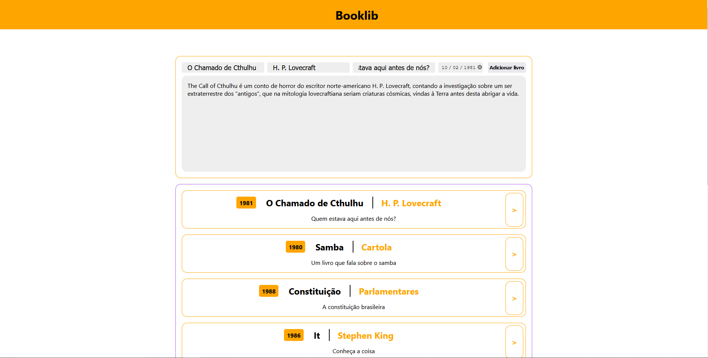

# Booklib
```
React project made with React, Next and Sass and consumes a Rest Api
```
--------------------------------------

<h2 align="center">
    Status
</h2>
<h3 align="center">
    Project in progress...
</h3>

---------------------------------------

<h2 align="center"> Features </h2>

- [X] Add new books
- [ ] View the added books (TODO)
- [ ] User signup (TODO)

--------------------------------------

<h2 align="center"> Technologies used </h2>

- react
- sass
- axios
- next
- moment

----------------------------------------

<h2 align="center"> Running the project </h2>

### Prerequisites
- LTS Node version
- Npm or yarn installed
- An editor or IDE to see the code

### How to run
- Create a new folder and clone the repo:
    - Type `git clone https://github.com/DavidEsdrs/booklib-client.git` on your terminal
- Run `npm run dev` or `yarn dev` to lauch the server
- It will run the server on `http://localhost:4000`, open it in the browser

-----------------------------------------
<h2 align="center"> Screenshots </h2>

